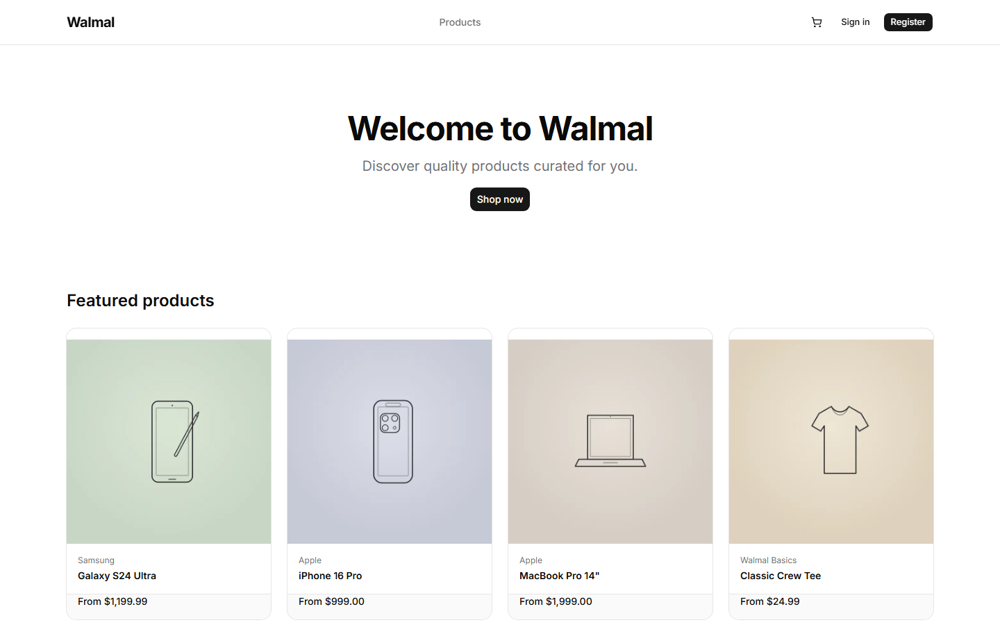
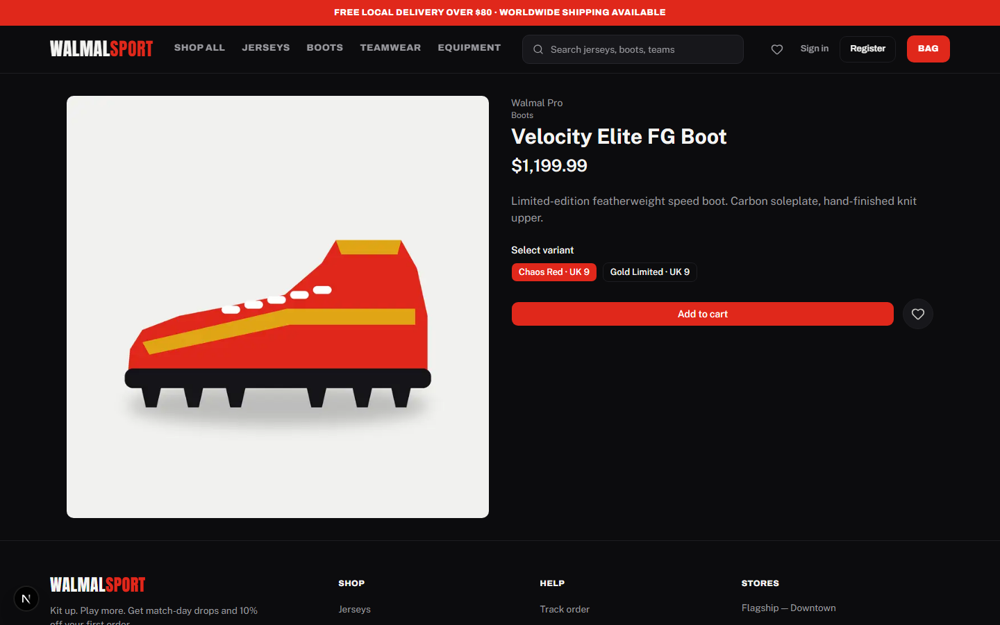
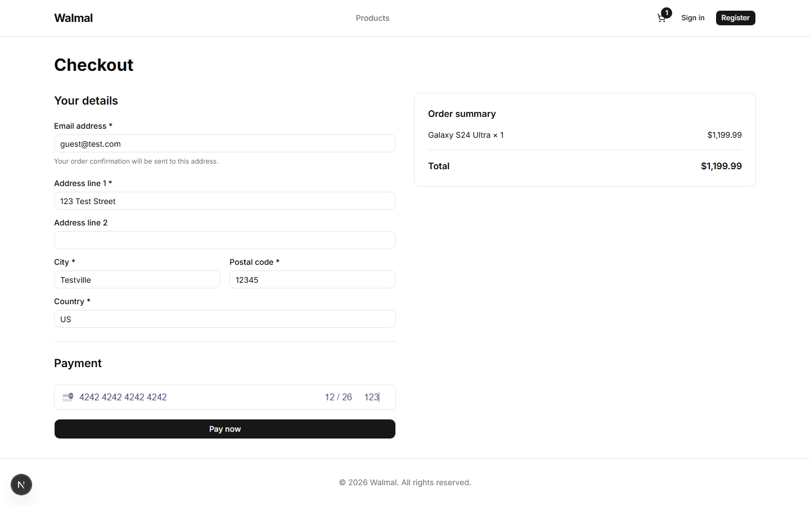

# walmal-store

[](https://github.com/YeHtutAung/walmal-store/actions/workflows/ci.yml)

Customer storefront for the walmal e-commerce system, branded **Walmal
Sport** — a dark-theme sports store (Anton/Archivo/Public Sans type, red
accent) selling match kits, boots and training gear. Next.js App Router
frontend over a real Spring Boot backend — guest and registered checkout,
Stripe test-mode payments, and a 120-test Playwright suite that runs against
the live backend rather than mocks.



## Features

- **Guest and registered checkout** — `/checkout` offers "Continue as guest"
  or sign-in; guest orders capture email + shipping address inline.
- **Variant selection + catalog browsing** — product detail pages list
  active variants as selectable pills; "Add to cart" stays disabled until
  one is chosen.

  

- **Stripe CardElement payments (test mode)** — `checkout-form.tsx` requests
  a `clientSecret` from `POST /api/payment-intent`, then confirms the card
  payment client-side via `stripe.confirmCardPayment`.

  

- **Smart add-to-bag** — listing/homepage cards add single-variant products
  straight to the bag with a toast; multi-variant products route to the
  detail page's variant selector.
- **Local wishlist** — heart/Saved page backed by a `localStorage`-persisted
  Zustand store (`walmal-wishlist`); no backend round-trips.
- **Cart persistence + guest-cart merge** — cart state is a Zustand store
  persisted to `localStorage` (`walmal-cart`); `mergeGuestCart` reconciles
  local guest items into the server cart on silent token refresh.
- **Silent token refresh with an httpOnly refresh cookie** — the access
  token lives in memory only (no Zustand persistence); refresh tokens are
  stored in an httpOnly, secure, `SameSite=strict` cookie (`walmal-rt`,
  scoped to `/api/auth`) set by the `/api/auth/*` proxy routes, never
  exposed to client JS.
- **Server-side `/account` route guarding** — `src/middleware.ts` redirects
  unauthenticated requests to `/account/*` to `/login?next=…` based on a
  presence cookie; the real enforcement is backend JWT validation.
- **Rate-limited API proxy routes** — an in-memory per-IP fixed-window
  limiter guards `/api/payment-intent` (10/min), `/api/auth/login` (5/min),
  `/api/auth/register` (3/min), and `/api/auth/refresh` (20/min).

## Stack

Next.js App Router, TypeScript, Zustand, Tailwind CSS + shadcn/ui, Stripe
(`@stripe/react-stripe-js` CardElement).

## Running locally

Requires the walmal Spring Boot backend running on `:8080` — see
[github.com/YeHtutAung/walmal](https://github.com/YeHtutAung/walmal) for the
quickstart (Docker Compose services + the Spring Boot JAR).

```bash
npm install
```

Create `.env.local` with:

```
NEXT_PUBLIC_API_URL=
NEXT_PUBLIC_STRIPE_PUBLISHABLE_KEY=
STRIPE_SECRET_KEY=
```

`NEXT_PUBLIC_API_URL` points at the backend (`http://localhost:8080/api/v1`
locally). The two Stripe keys are a matching test-mode publishable/secret
pair from the [Stripe dashboard](https://dashboard.stripe.com/apikeys).

```bash
npm run dev
```

## Tests

CI (GitHub Actions) runs lint, the unit suite, and a production build on
every push and PR. The 120-test Playwright matrix (40 unique tests ×
chromium/firefox/webkit) runs **locally as the pre-merge gate** — it needs
the real backend stack (Docker services + a test-profile Spring Boot JAR on
`:8080`) and real Stripe test keys, which stay out of CI by design.
`playwright.config.ts` auto-boots everything:

```bash
npx playwright test
```

The frontend security checklist is 44 PASS / 1 N/A (a mock-route control
whose subject was deleted), tracked in
[`tests/security/FRONTEND_CHECKLIST.md`](tests/security/FRONTEND_CHECKLIST.md).

Unit tests (Vitest, 17 files covering stores, API clients, components, the
rate limiter, and pure helpers like the category-slug resolver):

```bash
npx vitest run
```

## System documentation

For backend architecture, cross-repo contracts (auth, error bodies, events,
ports, env vars), and the sibling admin app, see the hub repo:
[github.com/YeHtutAung/walmal](https://github.com/YeHtutAung/walmal).

Agent-facing knowledge for this repo lives in `docs/kb/` (architecture,
conventions, gotchas, testing).
